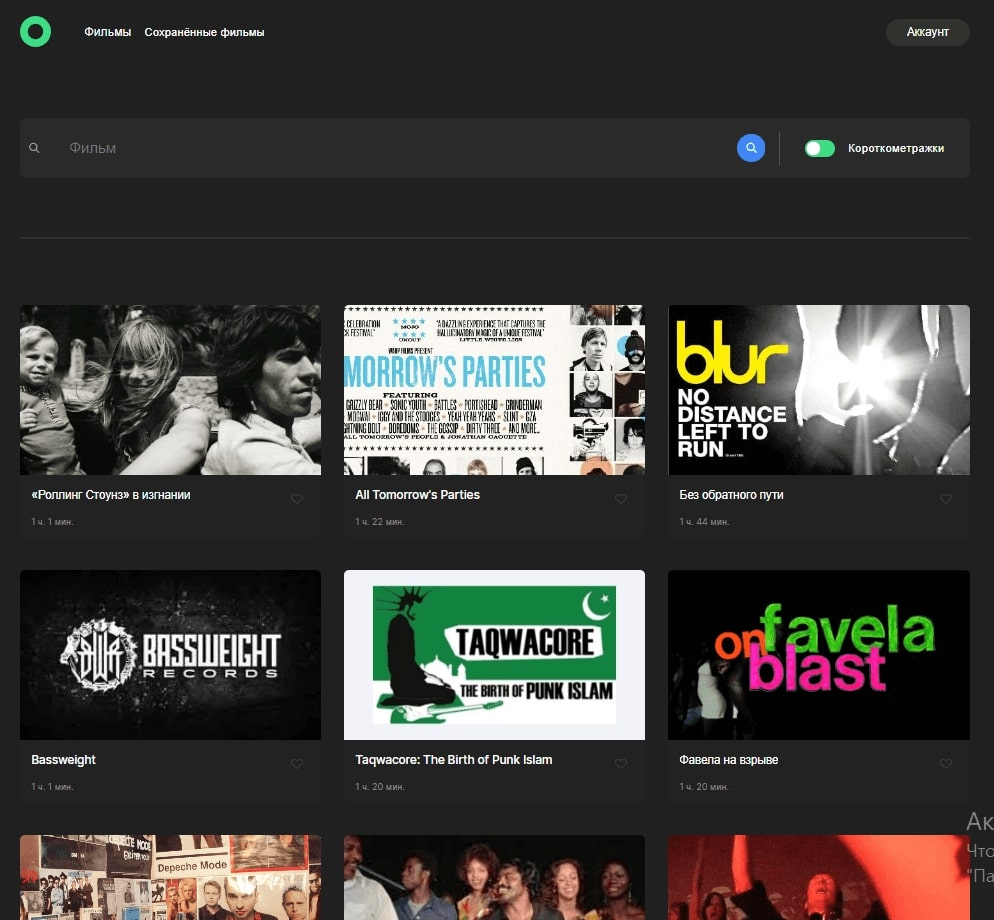
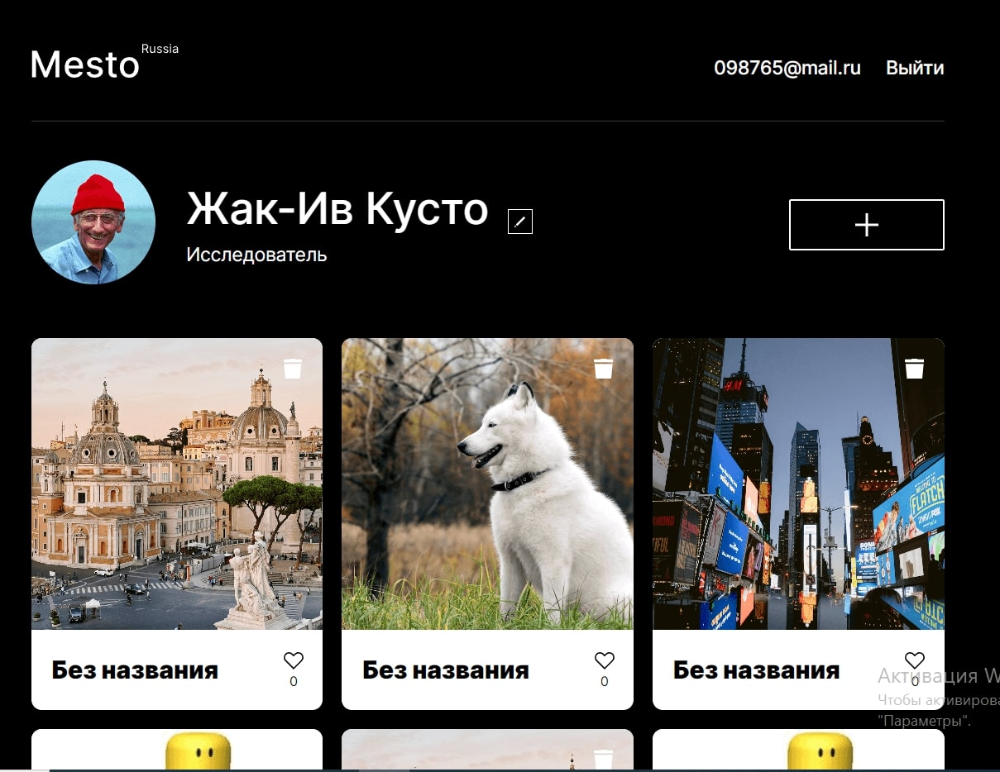
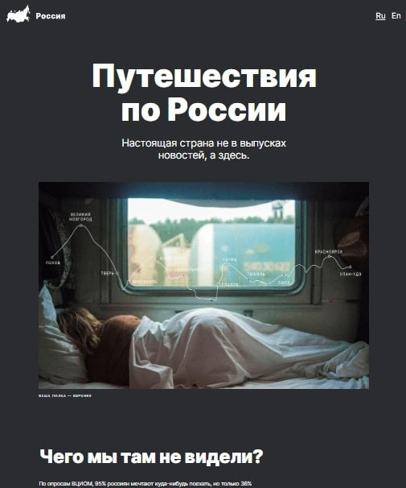

<!-- Заголовок профиля -->

    
    

<h1 align="center">Hi!👋 I'm Zulfiya.</h1>

<!-- Описание профиля -->
<h2>
About me:
</h2>

<i>Привет!</i>

<!-- Стек технологий -->
## My Tech Stack

<!-- Обучение -->

<h3>Education</h3>
    
<ul>
     <li> <a href="https://practicum.yandex.ru/web/" target="_blank">Web development, Yandex Practicum</a></li>
<ul>
     <li>

To see certificate click here

     
     

     </li>
   </ul>
</ul>

<h3>My projects</h3>

<table border="1">
  <tr>
    <th>Project</th>
    <th width="35%">Preview</th>
  </tr>

 <tr>
    <td>
      <h3 style="color: grey">Movies-explorer</h3>
      
<strong>Tools: React, JavaScript, Flexbox, Grid Layout, Webpack, Html/Css</strong>

      
Movie search application with user authorization and registration.

      
My project has the following functions: 

      <ul>
        <li>Layout according to BEM methodology;</li>
        <li>Adaptability at different resolutions - 1280px, 1024px, 768px, 320px, including breakpoints;</li>
        <li>Using grid and flex technologies;</li>
        <li>User authorization and registration, editing user data;</li>
        <li>Search for movies, add and delete movies to favorites;</li>        
      </ul>
      
You can find the code <a href="https://github.com/ZulfiyaKurmanaeva/movies-explorer-frontend" target="_blank">here</a>.

      
The result <a href="https://diplomov.nomoreparties.sbs/" target="_blank">here</a> or you can click on the image on the right.
 
    </td>
    <td>
      
Click preview

      
    </td>
  </tr>

 <tr>
    <td>
      <h3 style="color: grey">Mesto</h3>
      
<strong>Tools: HTML5, CSS3, JavaScript, Webpack</strong>

      
An application where users can share photos of their favorite places.

      
My project has the following functions: 

      <ul>
        <li>Layout according to BEM methodology;</li>
        <li>Adaptability at different resolutions, including breakpoints;</li>
        <li>Using grid and flex technologies;</li>
        <li>User authorization and registration, editing user data;</li>
        <li>Adding and deleting photos and likes;</li>        
      </ul>
      
You can find the code <a href="https://github.com/ZulfiyaKurmanaeva/react-mesto-api-full-gha/" target="_blank">here</a>.

      
The result <a href="https://uno.nomoredomains.rocks/" target="_blank">here</a> or you can click on the image on the right.
 
    </td>
    <td>
      
Click preview

      
    </td>
  </tr>

  <tr>
    <td>
      <h3 style="color: grey">Travel guide</h3>
      
<strong>Tools: Html/Css, Flexbox, Grid, CSS-animation</strong>

      
Project “Traveling around Russia” is an responsive site for planning trips around Russia with a lot of photos.

      
My project has the following functions: 

      <ul>
        <li>Layout according to BEM methodology;</li>
        <li>Adaptability at different resolutions, including breakpoints;</li>
        <li>Using grid and flex technologies;</li>
        <li>Pseudo-classes and pseudo-elements, animation to create interactivity;</li>
        <li>Variety of semantics;</li>        
      </ul>
      
You can find the code <a href="https://github.com/ZulfiyaKurmanaeva/russian-travel" target="_blank">here</a>.

      
The result <a href="https://zulfiyakurmanaeva.github.io/russian-travel/index.html" target="_blank">here</a> or you can click on the image on the right.
 
    </td>
    <td>
      
Click preview

      
    </td>
  </tr>

<tr>
    <td>
      <h3 style="color: grey">PROdocumenty</h3>
      
<strong>Tools: HTML, CSS, Flexbox</strong>

      
A commercial project developed for a licensing company.

      
My project has the following functions: 

      <ul>
        <li>Layout according to BEM methodology;</li>
        <li>Adaptability at different resolutions, including breakpoints;</li>
        <li>Using flex technologies;</li>        
      </ul>
      
You can find the code <a href="https://github.com/ZulfiyaKurmanaeva/PROdocumenty/" target="_blank">here</a>.

      
The result <a href="https://zulfiyakurmanaeva.github.io/PROdocumenty/" target="_blank">here</a> or you can click on the image on the right.
 
    </td>
    <td>
      
Click preview

      
    </td>
</tr>

  </table>

<!-- Контакты -->
## Contact Information

- Email: kurzul13@gmail.com
- Telegram: [@ninel3000](https://t.me/ninel3000)

